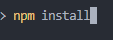
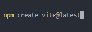
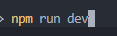
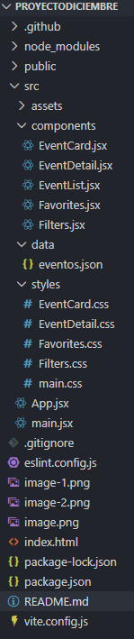

# AUTOR: Juan Carlos Piñas Muñoz

# Trabajo de Despliegue JCPM - Agenda Web de Eventos del Centro

He creado una aplicación web desarrollada en **React** utilizando **Vite**. Permite consultar y organizar eventos del centro como charlas, torneos, talleres o excursiones. Los usuarios pueden buscar, filtrar, ver detalles y marcar eventos como favoritos.

---

## Tecnologías utilizadas

- **React**: para construir la interfaz por componentes y manejar estados.
- **Vite**: para crear un proyecto rápido y con build optimizado.
- **CSS modular**: cada componente tiene su propio archivo CSS.
- **JavaScript moderno (ES6+)**

---

## Estructura del proyecto

ProyectoDiciembre/
│
├─ public/
│ 
│
├─ src/
│ ├─ components/
│ │ ├─ EventCard.jsx
│ │ ├─ EventDetail.jsx
│ │ ├─ EventList.jsx
│ │ ├─ Favorites.jsx
│ │ └─ Filters.jsx
│ │
│ ├─ data/
│ │ └─ eventos.json
│ │
│ ├─ styles/
│ │ ├─ main.css
│ │ ├─ EventCard.css
│ │ ├─ EventDetail.css
│ │ ├─ EventList.css
│ │ ├─ Favorites.css
│ │ └─ Filters.css
│ │
│ └─ App.jsx
│ │
│ │
│ └─ main.jsx
│
│
├─ package.json
└─ vite.config.js
└─ index.html
└─ eslint.config.js
└─ package-lock.json

## Cómo ejecutar el proyecto

1. Clonar o descargar el repositorio.
2. Instalar dependencias en el terminal:

    npm install
    npm run dev
    http://localhost:5173
    <!-- Por si queremos crear una version optimizada para produccion -->
    npm run build

## Funcionalidades

1. Pantalla principal - Lista de eventos

    Muestra todos los eventos con título, categoría, fecha y lugar.
    Permite filtrar por texto (título o lugar) y por categoría.
    Muestra un contador: “Mostrando X de Y eventos”.
    Botón “Ver Detalle” para cada evento.

2. Detalle del evento

    Muestra información completa del evento: título, categoría, fecha, lugar y descripción.
    Permite añadir el evento a favoritos.
    Si ya está en favoritos, se desactiva el botón y muestra “En Favoritos”.
    Botón para volver a la pantalla principal.

3. Favoritos

    Lista de eventos marcados como favoritos.
    Permite eliminar un evento de favoritos.

4. Estados y errores

    Muestra “Cargando…” mientras se cargan los datos desde eventos.json.
    Si el archivo no carga o está vacío, se muestra un mensaje de error.

## Componentes Principales

## Componente	        Función
EventCard	     -->       Muestra los datos básicos de un evento en una tarjeta.
EventList	     -->       Recorre el array de eventos y renderiza EventCard por cada evento.
EventDetail	     -->       Muestra información completa de un evento y botón de favoritos.
Favorites	     -->       Lista los eventos marcados como favoritos con opción de eliminar.
Filters	         -->       Permite filtrar eventos por texto y categoría.

## Estado y lógica de React

events → lista de todos los eventos.

selectedEvent → evento seleccionado para ver detalle.

favorites → lista de eventos favoritos.

search → texto de búsqueda.

category → categoría seleccionada en el filtro.

cargando → indica si se están cargando los datos.

error → mensaje de error si falla la carga de datos.

## Notas finales

Cada componente tiene CSS independiente para mantener la modularidad.

El proyecto está preparado para crecer y añadir backend si se desea.

La arquitectura con React + Vite permite un desarrollo rápido y profesional.

# Pasos para crear el proyecto con VITE + React

# Crear proyecto usando plantilla de React
npm create vite@latest "nombre_proyecto"

# Entrar en la carpeta del proyecto
cd "nombre_proyecto"

# Instalar dependencias
npm install

# Ejecutar el poryecto en modo de desarrollo
npm run dev

# Crear version de produccion (En caso necesario)
npm run build → genera los archivos optimizados en la carpeta dist/
npm run preview → permite probar la versión de producción localmente

